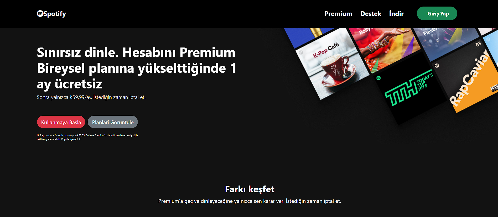
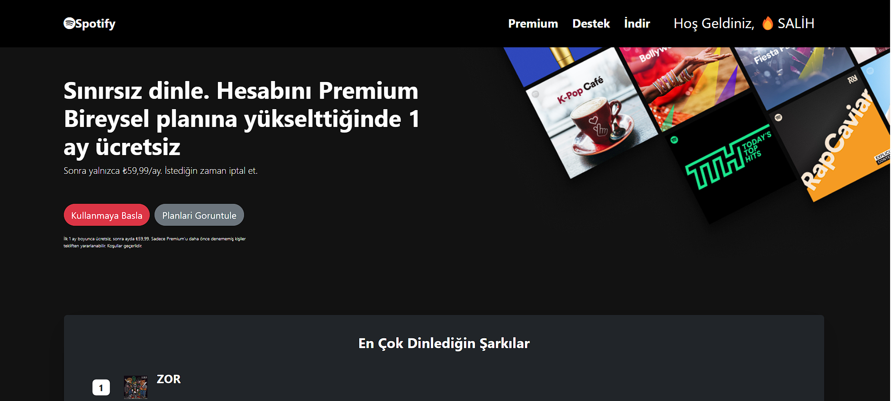
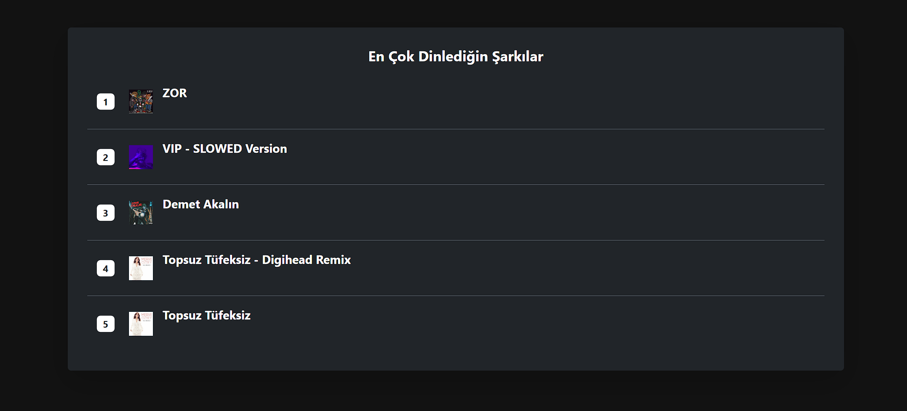
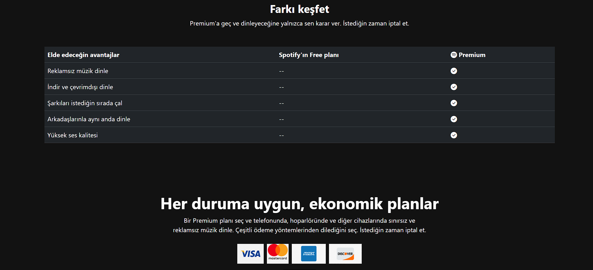
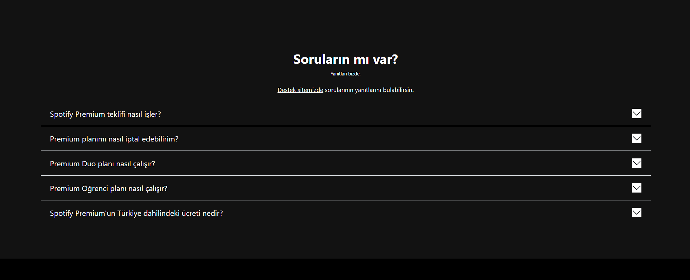
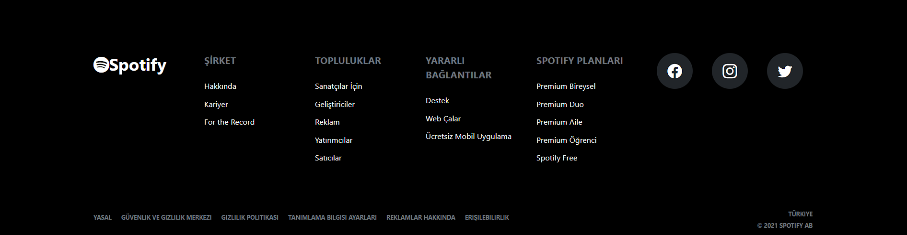

# Spotify UI Clone with API Integration

## Project Description

This project is a **React** based Spotify UI clone. In my first version, I only focused on UI design. However, in this version, I added **Spotify API** integration to dynamically fetch the user's name and the first 5 songs they have listened to.

### Features
- After the user logs in, the **Spotify API** fetches the user's information and their first 5 songs.
- The **First 5 Songs** are displayed in a table, showing the song name, artist, and album image.
- The application stores the user’s data (name and songs) in **localStorage**, so the data persists even if the page is refreshed.
- Once logged in, the user's name and the list of songs are visible on the page. When the page is refreshed, the data remains intact.

### Technologies Used
- React
- Spotify API
- LocalStorage

### Project Structure

